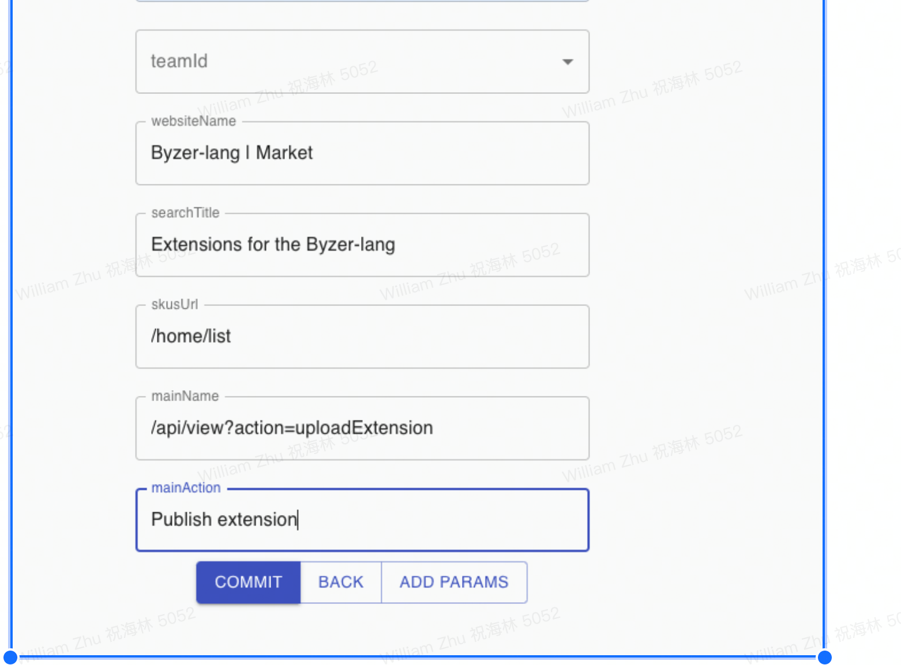

# Byzer Data as Form

Byzer Data as Form 是一款 Form 管理和使用产品，该产品需要配合 [Byzer社区](https://byzer.org/) 的 
[Byzer Notebook](https://docs.byzer.org/#/byzer-notebook/zh-cn/)/[Byzer-lang](https://github.com/byzer-org/byzer-lang)
制作 Form后 然后发布到该产品中。

Byzer Data as Form 的使命是 **Help People Deliver Data Value**。

## 部署

### 前置条件

1. 需要提前安装 MySQL 数据库 (项目根目录下的 db/db.sql 为库表结构)

### 配置文件

config 目录下的 `application-example.yml` 改成  `application.yml`。值得注意的配置：

1. 数据库链接需要改动
2. admin_token 需要在配置文件里配置，请随机生成一个 UUID。
3. notebookAccessToken 是为了让该应用能够访问 Byzer Notebook
4. storage 需要配置一个路径，用于存放 插件文件以及图片文件。
5. domain 默认为 http://market.byzer.org/form，该域名用来生成提供图片链接
6. fileSizeLimit: 1m  可以配置上传图片的大小 默认为100m，推荐设置为5m 以内。

### 项目打包

下载如下项目依赖：

1. https://github.com/allwefantasy/web-platform
2. https://github.com/allwefantasy/app_runtime_with_db
3. http://github.com/allwefantasy/user-system
4. http://github.com/allwefantasy/ar_runtime_web_console

分别执行：

```
mvn -DskipTests  install
```

然后运行根项目下的脚本：

```
./dev/package.sh
```

### 项目启动

在 release 目录的发行版里，运行 `./bin/start.sh` 进行启动。


启动后访问：`http://127.0.0.1:9007/web/#/api/list`查看界面。

### 启动后配置

首先我们填写网站信息：

可以通过地址： http://127.0.0.1:9007/#/api/list 查看所有可用的API。 我们第一步是使用/config/home API 对站点进行配置


一个填写例子：



此时项目主页应该是可以正常显示了,显示的内容如下：


                         
接着我们需要开放注册支持，让内部用户可以自己进行注册,  可以访问地址： `http://xxxx/web/#/api/view?action=controlReg`


允许用户进行注册。

注意，注册用户需要通过审核才能处于【激活】状态。 没有通过审核的用户无法登录。

你可以通过如下 API 进行审核：


点击进去后可以查看所有到所有没有被审核的用户。注意查看这些信息需要你有管理员权限，也就是需要填写 `admin_token`,该 token 配置在 `application.yml`
文件里。

接着找到 `/usr/activate` API,进入，然后填写需要激活的用户即可。 


## Form 制作

在 Byzer Notebook 中， 开发如下代码：

```
set FORM_VISIBILITY = "__PUBLIC__";
-- set VISIBILITY = "user:jack";
-- set VISIBILITY = "team:byzer > role:dev";
-- set VISIBILITY = "team:byzer > role:dev,team:byzer > role:";

set title = "快递查询帅气" where type="defaultParam" and formType="title" ;

set trackingNumbers="99992837379" where type="defaultParam" and formType="input" and label="快递单号，多个请用逗号分隔";

set trackingType="0" where type="defaultParam" and formType="select" and label="快递类型" and textProvider="接受,发送;0,1";

set trackingNum="1,2,3";
set trackingNum=`select concat_ws(",",transform(split("${trackingNumbers}",","),value-> concat('"',value,'"')))` where type="sql" and mode="runtime";

connect jdbc where
 url="jdbc:mysql://127.0.0.1:3306/wow?characterEncoding=utf8&zeroDateTimeBehavior=convertToNull&tinyInt1isBit=false"
 and driver="com.mysql.jdbc.Driver"
 and user="xxxxx"
 and password="xxxxx"
 as mysql_instance;
 
 
 
load jdbc.`mysql_instance.trackers` as temptable; 

select trackingNumber as `订单号`,msg as `状态`, 
case receive when 0 then "接收" else "发送" end
as `类型` 
from temptable 
where trackingNumber in (${trackingNum}) 
and  receive=${trackingType}
as output;
```

开发完成后，记录下该 notebook的 id, 假设为 48, 此时可以进 Data As Form 平台上进行表单发布，先登录。


点击 Publish Form 后进入发布界面：


填写表单的一些信息，该表单就会出现在主界面。


